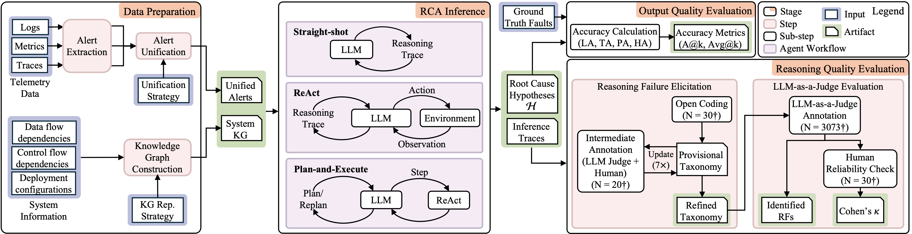
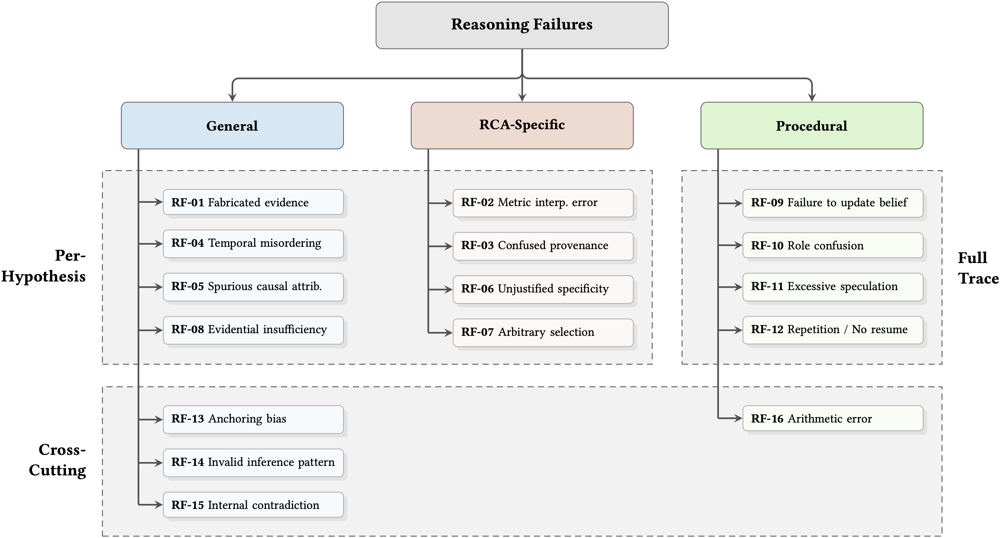

# Stalled, Biased, and Confused: Uncovering Reasoning Failures in LLMs for Cloud-Based Root Cause Analysis

&ensp;
[](https://opensource.org/licenses/MIT)&ensp;
[](https://doi.org/10.1145/3793655.3793732)&ensp;
[](https://hdl.handle.net/10012/22841)

> 📣 **Our paper has been accepted to FORGE 2026!**

*This project is also detailed in a Master's Thesis: [Grounded or Guessing? An Empirical Evaluation of LLM Reasoning in Agentic Workflows for Root Cause Analysis in Cloud-based Systems](https://hdl.handle.net/10012/22841).*

## Overview

We contribute a systematic **evaluation framework** designed to isolate and assess the diagnostic reasoning capabilities of Large Language Models (LLMs) for Root Cause Analysis (RCA) in cloud-based systems.

While LLMs are increasingly adopted for RCA, current approaches often embed them within complex, multi-agent workflows. This entanglement makes it difficult to assess individual agent contributions, obscuring whether a correct diagnosis results from genuine reasoning or auxiliary task heuristics.

We address this by providing a controlled RCA setting that isolates the LLM from confounding factors (e.g., noisy telemetry, inter-agent chatter). By employing simple agent architectures, deterministic tools, and explicit typed knowledge graphs, this framework foregrounds reasoning behavior, allowing for the targeted analysis of both final outputs and intermediate reasoning traces.
<div align="center">  </div>

Additionally, we produce a labeled taxonomy of **16 common RCA reasoning failures** and an **LLM-as-a-Judge** setup for annotation.
<div align="center">  </div>


## 📂 Project Structure

### 1. Source Code ([`code/`](./code/))
The core logic for data processing, RCA inference, and LLM-as-a-Judge.
- [`alert-extractor/`](./code/alert-extractor/): Pipeline for converting raw telemetry into the alert format used by the RCA inference stage.
- [`rca.py`](./code/rca.py): The main entry point for running RCA inference.
- [`rca_eval_judge_openai.py`](./code/rca_eval_judge_openai.py): The main entry point for running the LLM-as-a-Judge for Reasoning Failure (RF) identification.
- [`config/prompts/`](./code/config/prompts/effect-to-cause/): Contains the prompts for RCA inference and LLM-as-a-Judge.

### 2. Input Data ([`data/`](./data/))
This directory contains all input artifacts required for RCA inference:
- [**Entity-relationship specifications**](./data/entity-relationships/): Defines the KG schema (node and relationship types) provided to the LLM.
- [**System knowledge graphs**](./data/system-knowledge-graphs/): The KG for each target system.
- [**Fault alert data**](./data/fault-alerts/): The alerts and ground-truth `label.csv` files for each system (product of the alert extraction pre-processing step).

### 3. Experimental Results ([`results/`](./results/v4/))
We organize results hierarchically by:
**Model** &rarr; **System** &rarr; **Task** &rarr; **Modalities** &rarr; **KG Strategy** &rarr; **Unification Strategy**

```text
results/v4/
├── [Model name]/             # e.g., llama3.3, qwen3:32b
│   └── [System name]/        # e.g., MicroSS (A), Online-Boutique-cloudbed-1 (B)
│       └── effect_to_cause/
│           ├── all-modalities/                      # Full data (logs + metrics + traces)
│           │   └── [KG representation strategy]/    # "json" or "list"
│           │       └── [Unification_Strategy]/      # "by-time" or "by-component"
│           │           ├── responses-model-only-full.txt    # Straight-Shot
│           │           ├── responses-react.txt              # ReAct
│           │           └── responses-plan-execute-react.txt # Plan-and-Execute
│           ├── logs-excluded/                       # Ablation studies
│           ├── metrics-excluded/
│           └── traces-excluded/
```

**File format**: each line in the `.txt` files is a JSON object representing the `ModelResult` for a single sample with `fault_id`.

### 4. LLM-as-a-Judge Evaluation
Located at [`results/v4/evaluation/llm-judge/`](./results/v4/evaluation/llm-judge/llm_judge_sample.zip).
- [`llm_judge_sample.zip`](./results/v4/evaluation/llm-judge/llm_judge_sample.zip): The 3,073 RCA inference traces randomly sampled for evaluation.
- The `openai_batch_00X_*.jsonl`: Formatted OpenAI batch upload files.
- The `openai_batch_output_batch_*.jsonl`: The formatted GPT-5 LLM-as-a-Judge outputs.


## 🚀 Quick Start

### Installation

Use the following commands:

Install `pixi` according to https://pixi.prefix.dev/latest/installation/
```bash
curl -fsSL https://pixi.sh/install.sh | sh
```
Re-open the terminal to make `pixi` available.

```bash
# Clone the repository
git clone https://github.com/boerste/rca-llm-reasoning.git
cd rca-llm-reasoning

# In one terminal, start ollama
pixi run ollama serve

# In another terminal

# Pull ollama models
pixi run pull_llama3-2-3b
# Test a model to verify that it runs on the GPU
pixi run ollama run llama3.2:3b

pixi run pull_qwen3-4b
pixi run pull_qwen3-32b
pixi run pull_llama3-3
pixi run pull_command-r-plus
```

Start gradio user interface:
```bash
pixi run ui
```
and open `http://127.0.0.1:7860`.

Execute in batch mode:
```bash
pixi run rca
```

### Dependencies

For our experiments, we used the following versions:
- [`ollama == 0.11.4`](https://github.com/ollama/ollama/releases/tag/v0.11.4)
- `langchain == 0.3.27`
- `langchain-core == 0.3.74`
- `langchain-ollama == 0.3.6`
- `langgraph == 0.6.4`

The environment `default` uses more recent versions of the dependencies, whereas 
the environment `reproduction` matches the above versions more closely, except:
* `CUDA` 12.9 instead of 12.4
* `langchain-core` 0.3.76 instead of 0.3.74
* `langchain-ollama` 0.3.8 instead of 0.3.6

To run in this environment, provide the parameter `-e reproduction` to `pixi run` commands.
* `pixi run -e reproduction ollama serve`
* `pixi run -e reproduction rca`
* `pixi run -e reproduction ui`

Ollama models:
- [`llama3.2:3b`: ID=a80c4f17acd5](https://ollama.com/library/llama3.2:3b)
- [`qwen3:4b`: ID=e55aed6fe643](https://ollama.com/library/qwen3:4b)
- [`qwen3:32b`: ID=030ee887880f](https://ollama.com/library/qwen3:32b)
- [`llama3.3`: ID=a6eb4748fd29](https://ollama.com/library/llama3.3:70b)
- [`command-r-plus`: ID=e61b6b184f38](https://ollama.com/library/command-r-plus:104b)

---
## 📚 Citation

If you use our work in your research, please cite our **paper**:

```bibtex
@inproceedings{riddell2026forge,
    title={{Stalled, Biased, and Confused: Uncovering Reasoning Failures in LLMs for Cloud-Based Root Cause Analysis}},
    author={Evelien Riddell and James Riddell and Gengyi Sun and Michal Antkiewicz and Krzysztof Czarnecki},
    booktitle={IEEE/ACM Third International Conference on AI Foundation Models and Software Engineering (FORGE)},
    year={2026},
    doi={10.1145/3793655.3793732}
}
```

For expanded background, problem definition, and additional discussion, please refer to the **Master's thesis**:
```bibtex
@mastersthesis{riddell2026thesis,
    author = {Evelien Riddell},
    title = {{Grounded or Guessing? An Empirical Evaluation of LLM Reasoning in Agentic Workflows for Root Cause Analysis in Cloud-based Systems}},
    school = {{University of Waterloo}},
    year = {2026},
    url = {https://hdl.handle.net/10012/22841}
}
```