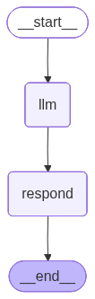
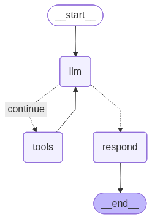
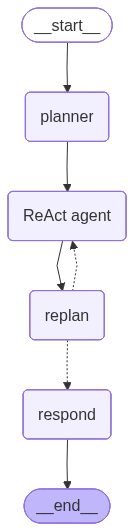

# RCA Inference

## Agentic Workflows
See: [`graphs.py`](./graphs.py)

The final *respond* step of each workflow is the generation of a *structured output*.

<div align="center" style="display:flex; gap:24px; justify-content:center; align-items:flex-start; flex-wrap:wrap;">
    <div style="min-width:220px; text-align:center;">
        <div><strong>Straight-Shot baseline</strong></div>
        <div><code>initialize_simple_graph_<br>structured_output_two_step</code></div>
        
    </div>
    <div style="min-width:220px; text-align:center;">
        <div><strong>ReAct</strong></div>
        <div><code>initialize_react_graph_<br>with_tool_retry_and_structured_output</code></div>
        
    </div>
    <div style="min-width:220px; text-align:center;">
        <div><strong>Plan-and-Execute</strong></div>
        <div><code>initialize_plan_execute_<br>react_shared_state</code></div>
        
    </div>
</div>

## System knowledge graph
The system knowledge graph is _directed, unweighted_, and _typed_.

**Terminology**:
_entity_ to describe the "nodes" in the graph
_relationship_ to describe the "edges" in the graph

The ER-specifications are defined in [`entity-relationships-specification.json`](../../data/entity-relationships/entity-relationships-specification.json).

**KG Schema**:
_Purpose_: understand what types of entities and relationships exist. Focuses on what can exist (and their meaning), rather than the actual data.
- `list_entity_types_and_attributes`
- `list_relationship_types`

This information is added to the initial RCA user query for **all** workflows. 

## Tools
See: [`tools.py`](./tools.py)

**Data Characteristics**:
_Purpose_: understand actual instances of entities and their relationships
- `check_node_existence`
- `get_node_attributes`
- `get_all_instances_of_entity_type`
- `get_edge_attributes`

**Traversal**:
_Purpose_: explore local graph structure and paths
- `get_node_neighborhood`
- `get_all_simple_paths`

## Structured Output
See: [`structured_output.py`](./structured_output.py)
During the *respond* step, the LLM must generate an output according to the following `RootCausesResponse` schema.

```json
{
    "root_causes": [
        {
            "type": "The type of root cause fault.",
            "description": "An explanation of the root cause fault.",
            "location": "The exact node or edge at which the root cause fault occurs.",
            "justification": "A step-by-step reasoning, grounded in the system knowledge graph, explaining how the symptoms could occur due to the root cause.",
            "relevant_path": "The specific propagation path in the knowledge graph that would make the root cause possible, formatted as node1 --(edge_label1)--> node2 --(edge_label2)--> node3.",
        }
    ]
}
```

## Prompts

- [Straight-shot baseline and ReAct](../config/prompts/effect-to-cause/rca-prompts.yaml)
- [Plan-and-Execute](../config/prompts/effect-to-cause/plan-execute-prompts.yaml)
- [Structured output (all workflows)](../config/prompts/effect-to-cause/structured-output-prompts.yaml)
